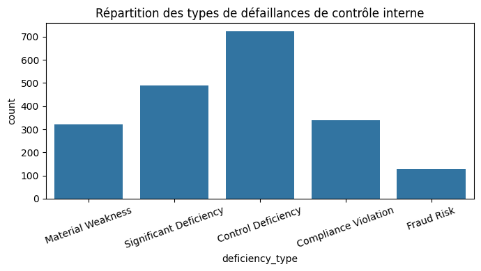
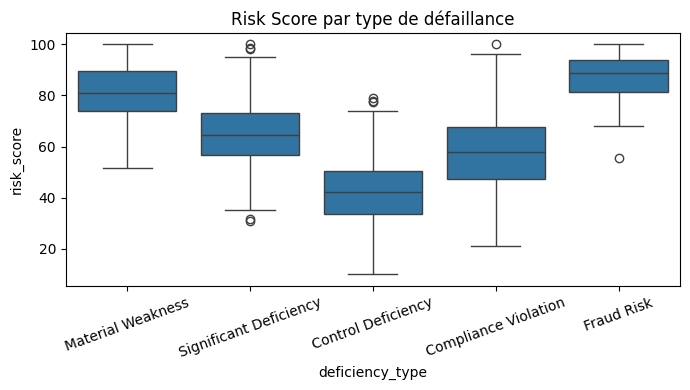
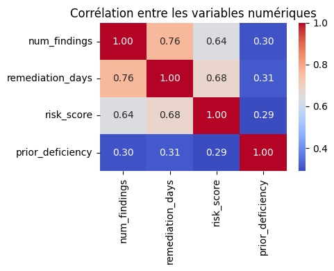
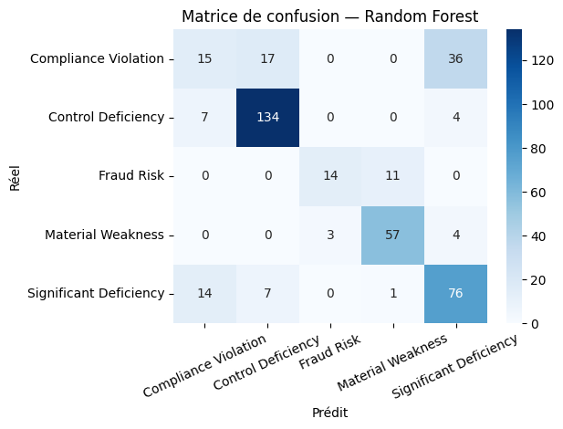
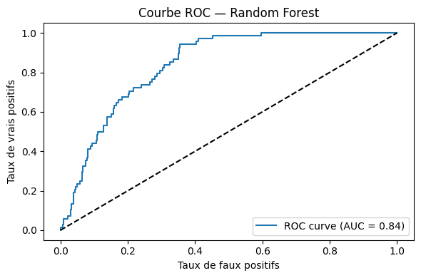

# Classification des Défaillances de Contrôle Interne par Type
## Projet IA — Apprentissage Automatique Supervisé

---

**Université Hassan 1er — ENCG Settat**
**Filière : Contrôle, Audit et Conseil**
**Réalisé par : Rajib Hidaya & Ezzaher Douaa**

---

## Sommaire

1. [Introduction](#introduction)
2. [Problématique et type de tâche](#problématique-et-type-de-tâche)
3. [Dictionnaire des variables](#dictionnaire-des-variables)
4. [Méthodologie](#méthodologie)
5. [Résultats](#résultats)
6. [Conclusion](#conclusion)

---

## Introduction

Le jeu de données utilisé porte sur la conformité au référentiel **SOX (Sarbanes-Oxley Act)** dans les entreprises cotées. Chaque ligne correspond à un rapport d'audit et contient des informations sur le profil de l'entreprise (taille, secteur, domaine de contrôle) ainsi que des indicateurs de risque et de défaillance de contrôle interne.

L'objectif est d'utiliser ces informations pour classifier automatiquement le **type de défaillance de contrôle interne** identifiée lors d'un audit.

---

## Problématique et type de tâche

> Peut-on classifier automatiquement le type de défaillance de contrôle interne à partir des caractéristiques d'un rapport d'audit SOX ?

Il s'agit d'une **classification multiclasse supervisée**. La variable cible peut prendre cinq valeurs :
- `Material Weakness` — défaillance grave susceptible d'affecter les états financiers
- `Significant Deficiency` — déficience importante mais moins critique
- `Control Deficiency` — déficience mineure, portée limitée
- `Compliance Violation` — non-respect d'une disposition réglementaire
- `Fraud Risk` — présence d'indicateurs de risque de fraude

---

## Dictionnaire des variables

| Variable | Type | Description |
|----------|------|-------------|
| `company_size` | Catégorielle | Taille de l'entreprise (Small / Medium / Large) |
| `industry_sector` | Catégorielle | Secteur d'activité |
| `control_area` | Catégorielle | Domaine de contrôle concerné |
| `num_findings` | Numérique | Nombre de constats identifiés |
| `remediation_days` | Numérique | Jours nécessaires pour la remédiation |
| `risk_score` | Numérique | Score de risque global (0–100) |
| `prior_deficiency` | Binaire | Défaillance lors de la période précédente (0/1) |
| `deficiency_type` | **Cible** | Type de défaillance (5 classes) |

---

## Méthodologie

### Pré-traitement

Un encodage One-Hot a été appliqué aux variables catégorielles (`company_size`, `industry_sector`, `control_area`). La variable cible a été encodée avec `LabelEncoder`. Les variables numériques continues (`risk_score`, `num_findings`, `remediation_days`) ont été standardisées avec `StandardScaler`. Le dataset a été divisé en 80 % entraînement et 20 % test, avec un split stratifié pour conserver les proportions de chaque classe.

### Algorithmes testés

Trois modèles de classification ont été comparés :
- **Régression logistique** : modèle de référence, simple et interprétable
- **Random Forest** : modèle d'ensemble robuste, sélectionné comme modèle principal
- **KNN** : modèle basé sur la similarité entre observations

### Validation et optimisation

Une validation croisée (5-fold) a été appliquée sur l'ensemble d'entraînement. La **Random Forest** ayant obtenu les meilleures performances, ses hyperparamètres (`n_estimators`, `max_depth`, `min_samples_split`) ont ensuite été optimisés via `GridSearchCV`.

---

## Résultats

### Analyse exploratoire (EDA)

Le graphique ci-dessous montre la répartition des 2 000 observations entre les cinq types de défaillances. `Control Deficiency` est la classe majoritaire (~36 %), tandis que `Fraud Risk` est la plus rare (~7 %), ce qui reflète les proportions observées dans les rapports PCAOB réels.

Les boxplots du `risk_score` confirment une séparation nette entre les classes. `Fraud Risk` et `Material Weakness` présentent les scores les plus élevés (médiane ~88 et ~82), tandis que `Control Deficiency` affiche les scores les plus bas (médiane ~42). Cette hiérarchie est cohérente avec la gravité de chaque type de défaillance.

La heatmap révèle une corrélation modérée à forte entre `num_findings`, `remediation_days` et `risk_score` (0.64 à 0.76) : plus les constats sont nombreux, plus la remédiation prend du temps et plus le risque est élevé. La variable `prior_deficiency` reste faiblement corrélée aux autres (0.29–0.31), ce qui confirme son apport indépendant au modèle.

### Performances des modèles

| Modèle | Accuracy CV (5-fold) |
|--------|----------------------|
| Logistic Regression | 76.38 % ± 1.02 % |
| **Random Forest** | **76.63 % ± 1.65 %** |
| KNN | 69.37 % ± 2.14 % |

La Random Forest obtient la meilleure accuracy en validation croisée. Après optimisation par GridSearchCV, les meilleurs hyperparamètres sont `max_depth=10`, `min_samples_split=5` et `n_estimators=200`, avec une accuracy CV de **76.63 %** et une accuracy sur le jeu de test de **74 %**.

Le détail par classe montre que `Control Deficiency` et `Material Weakness` sont très bien classifiées (F1 de 0.88 et 0.86). En revanche, `Compliance Violation` est la plus difficile à identifier (F1 de 0.29), car beaucoup de ses cas sont confondus avec `Significant Deficiency`, deux classes proches par nature.

La matrice de confusion illustre ces résultats : 134 cas de `Control Deficiency` sur 145 sont correctement prédits, mais 36 cas de `Compliance Violation` sur 68 sont mal classifiés.

La courbe ROC présente une **AUC de 0.84** pour la classe `Material Weakness` contre les autres. Le modèle se situe nettement au-dessus de la diagonale en pointillés (classifieur aléatoire), confirmant une bonne capacité de discrimination.

---

## Conclusion

Ce projet montre qu'il est possible de classifier automatiquement les défaillances de contrôle interne à partir de données SOX structurées. Parmi les trois modèles testés, la **Random Forest** offre les meilleures performances (74 % d'accuracy sur le jeu de test, AUC de 0.84) et constitue le meilleur choix pour cette tâche.

Les principales limites sont l'utilisation d'un dataset synthétique et le déséquilibre entre classes (`Fraud Risk` et `Compliance Violation` sous-représentés). Des pistes d'amélioration incluent la validation sur des données PCAOB réelles, l'application de SMOTE pour rééquilibrer les classes, et l'intégration de NLP pour analyser les textes des rapports d'audit.
